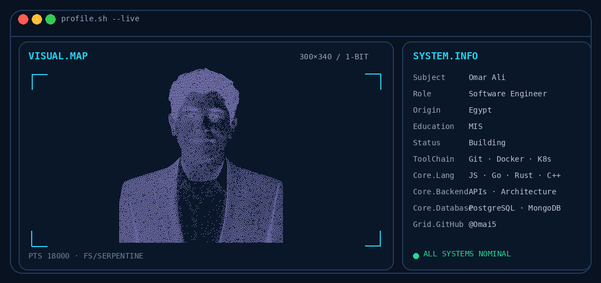
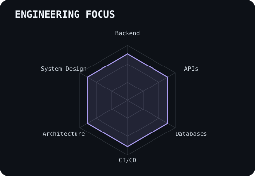
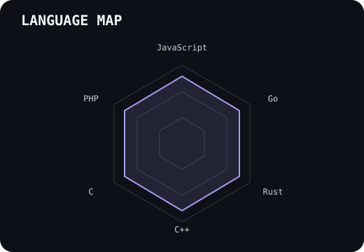
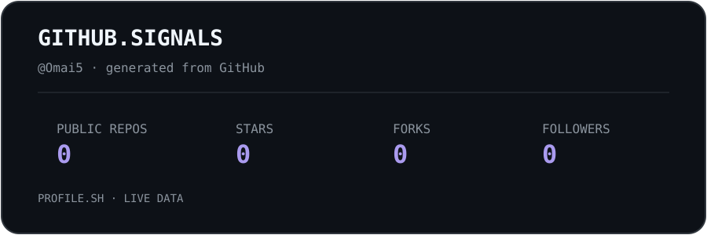
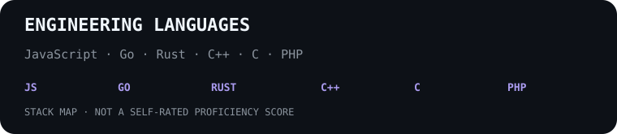

 

 

&nbsp;&nbsp;
&nbsp;&nbsp;
&nbsp;&nbsp;

 

---

## This is me

Hi, I'm **Omar Ali**, a **Software Engineer** focused on backend engineering, APIs, system design, software architecture, and scalable systems.

- **3+ Years** of software development experience through continuous learning, hands-on projects, and practical application
- Focused on **backend engineering, APIs, system design, and scalable architectures**
- Experienced with **JavaScript, Go, Rust, C, C++, PHP, Laravel, PostgreSQL, MongoDB, Docker, Kubernetes, and CI/CD**
- Studying **Management Information Systems MIS**
- Interested in building software from the system level and understanding the engineering decisions behind it

 

## my perfect stack

---

## signals

<table>
<tr>
<td width="50%" align="center" valign="middle">

<picture>
  <source media="(prefers-color-scheme: dark)" srcset="readme-assets/readme-radar-dark.svg">
  <source media="(prefers-color-scheme: light)" srcset="readme-assets/readme-radar-light.svg">
  
</picture>

</td>
<td width="50%" align="center" valign="middle">

<picture>
  <source media="(prefers-color-scheme: dark)" srcset="readme-assets/readme-radar-langs-dark.svg">
  <source media="(prefers-color-scheme: light)" srcset="readme-assets/readme-radar-langs-light.svg">
  
</picture>

</td>
</tr>
</table>

---

## Numbers matter

<picture>
  <source media="(prefers-color-scheme: dark)" srcset="readme-assets/readme-card-stats-dark.svg">
  <source media="(prefers-color-scheme: light)" srcset="readme-assets/readme-card-stats-light.svg">
  
</picture>

 

---

` Build with code · @Omai5 `

